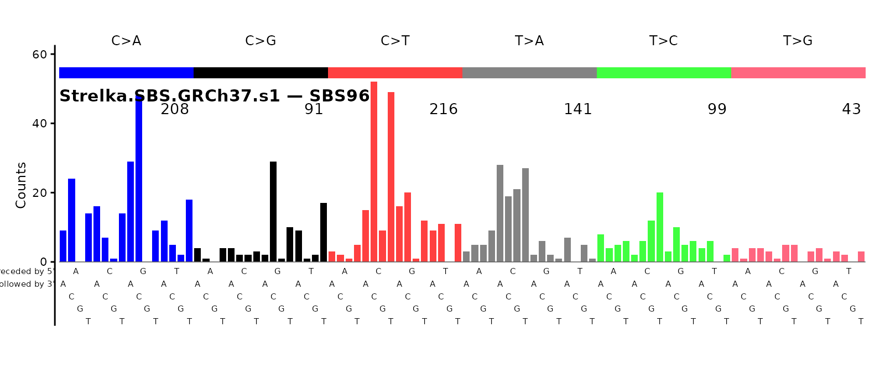
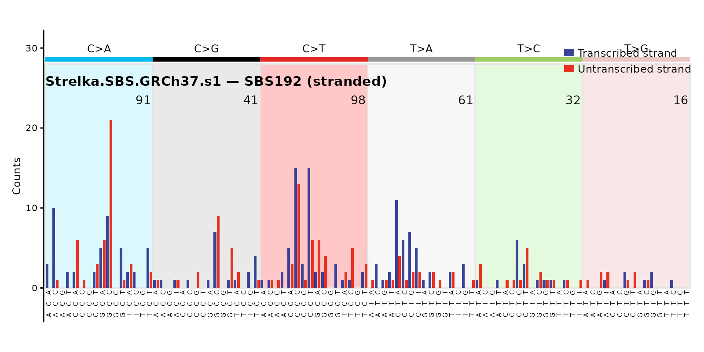
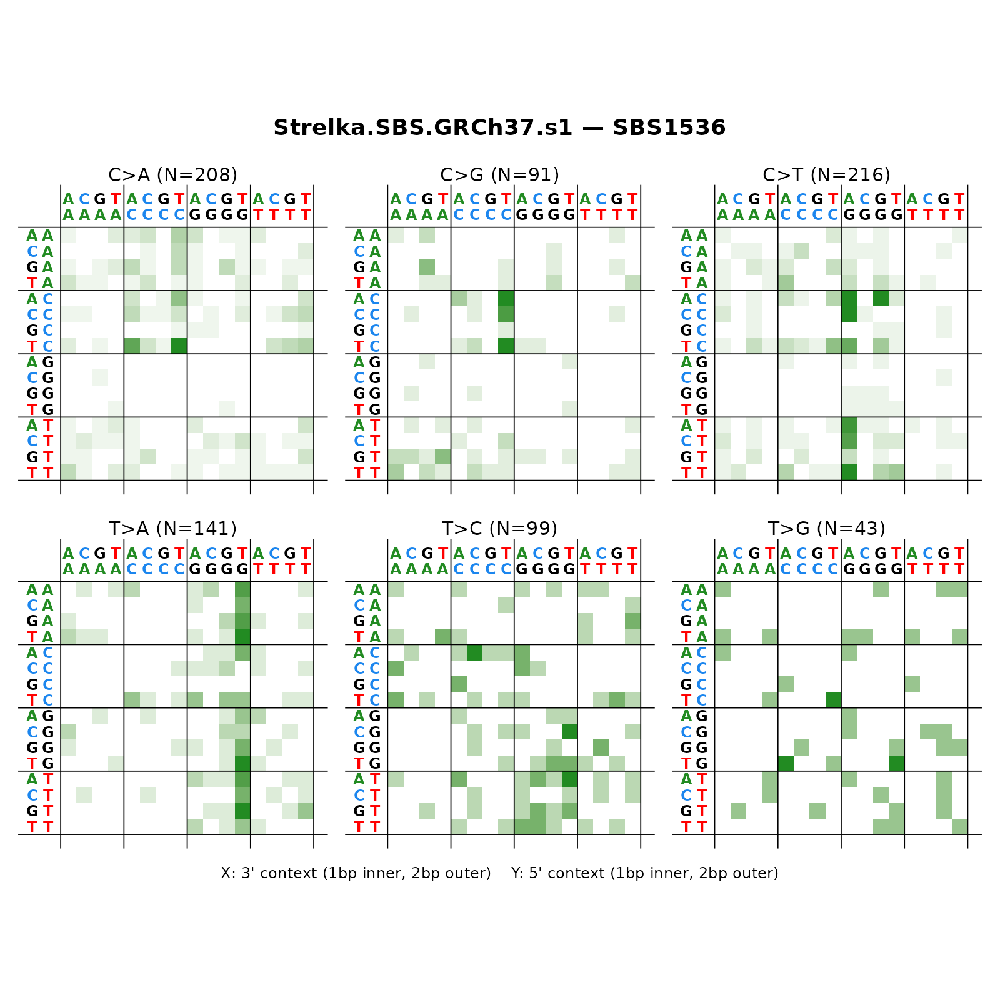
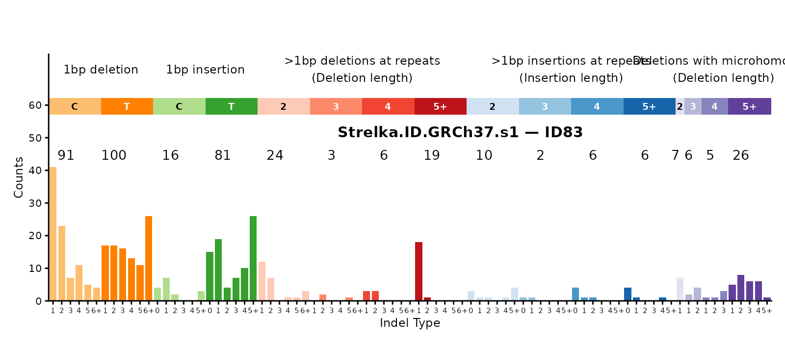
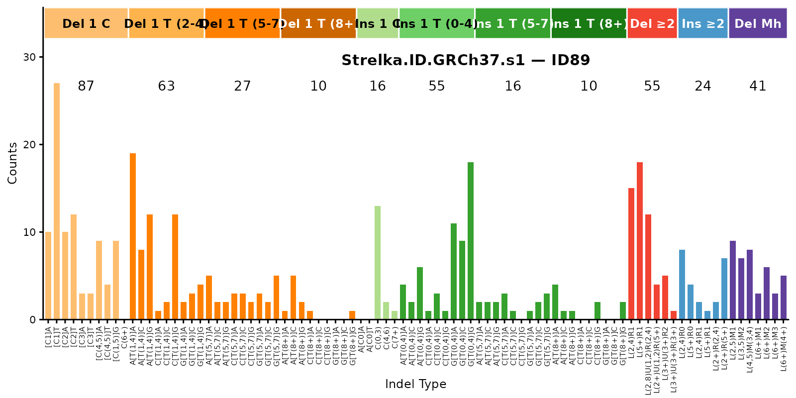
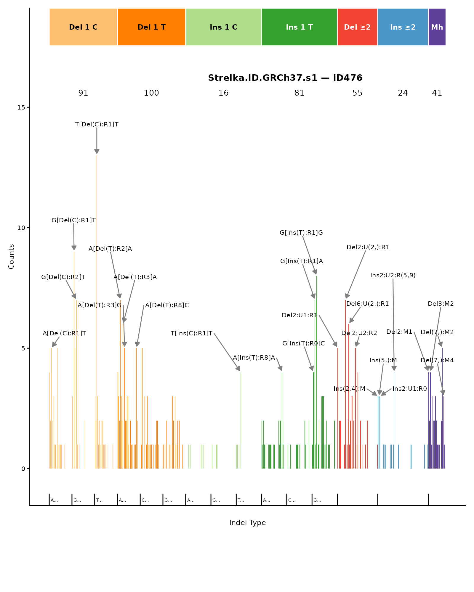
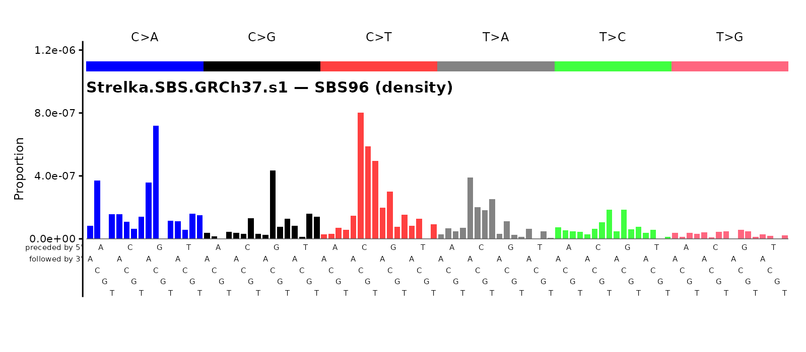

# Reading VCFs and Building Mutational-Spectrum Catalogs

This vignette walks through the four-step **mSigSpectra** pipeline —
`read_vcf` → `split_vcf` → `annotate_sbs_or_dbs_vcf` / `annotate_id_vcf`
→ `vcf_to_catalog` — using a real Strelka VCF that ships with the
package. It then plots each catalog with
[`mSigPlot`](https://github.com/steverozen/mSigPlot).

If you do not have the BSgenome package or `mSigPlot` installed, the
chunks below will be skipped at render time. To install:

``` r
BiocManager::install("BSgenome.Hsapiens.1000genomes.hs37d5")
remotes::install_github("steverozen/mSigPlot")
```

## 1. Load packages

``` r
library(mSigSpectra)
library(mSigPlot)
```

## 2. Locate test VCFs

Three example VCFs ship with the package: a Strelka SBS file, a Strelka
indel file, and a Mutect file (all small subsets, GRCh37 / hg19).

``` r
sbs_file <- system.file(
  "extdata", "Strelka-SBS-GRCh37", "Strelka.SBS.GRCh37.s1.vcf",
  package = "mSigSpectra"
)
id_file <- system.file(
  "extdata", "Strelka-ID-GRCh37", "Strelka.ID.GRCh37.s1.vcf",
  package = "mSigSpectra"
)
mutect_file <- system.file(
  "extdata", "Mutect-GRCh37", "Mutect.GRCh37.s1.vcf",
  package = "mSigSpectra"
)
```

## 3. Read the SBS VCF

[`read_vcf()`](https://steverozen.github.io/mSigSpectra/reference/read_vcf.md)
returns a `data.table` with whatever columns the VCF body contains. We
pass `filter = "PASS"` to match the Strelka convention.

``` r
sbs_vcf <- read_vcf(sbs_file, filter = "PASS")
nrow(sbs_vcf)
#> [1] 798
head(sbs_vcf[, c("CHROM", "POS", "REF", "ALT", "FILTER")])
#>     CHROM     POS    REF    ALT FILTER
#>    <char>   <int> <char> <char> <char>
#> 1:      1  906904      C      A   PASS
#> 2:      1 1821952      C      T   PASS
#> 3:      1 1963733      G      A   PASS
#> 4:      1 2249474      G      T   PASS
#> 5:      1 2545983      A      T   PASS
#> 6:      1 2738084      C      A   PASS
```

## 4. Split into SBS / DBS / ID sub-tables

[`split_vcf()`](https://steverozen.github.io/mSigSpectra/reference/split_vcf.md)
partitions rows by `REF`/`ALT` length alone. For a “pure SBS” VCF you
would expect everything in `$SBS`, but Strelka’s SBS caller can emit
adjacent SBS pairs that the indel caller does not see; mSigSpectra
**does not** merge them into DBSs (see “Gotchas” in the README) — they
stay as SBSs.

``` r
sbs_split <- split_vcf(sbs_vcf, name_of_vcf = "Strelka.SBS.GRCh37.s1")
sapply(sbs_split[c("SBS", "DBS", "ID")], nrow)
#> SBS DBS  ID 
#> 798   0   0
```

## 5. Annotate the SBS rows

[`annotate_sbs_or_dbs_vcf()`](https://steverozen.github.io/mSigSpectra/reference/annotate_sbs_or_dbs_vcf.md)
adds:

- `seq.<N>bases` — the flanking sequence context (default
  `seq.21bases`).
- For ref genomes with a shipped transcript-ranges table (GRCh37 /
  GRCh38 / GRCm38), the transcript-strand columns `trans.start.pos`,
  `trans.end.pos`, `trans.strand`, `trans.Ensembl.gene.ID`,
  `trans.gene.symbol`, plus `bothstrand` and `count` (number of
  overlapping transcripts).

It returns a list with `annotated.vcf` (the table below) and
`discarded.variants` (always `NULL` for SBS / DBS).

``` r
sbs_ann <- annotate_sbs_or_dbs_vcf(sbs_split$SBS,
                                   ref_genome = "GRCh37")$annotated.vcf
new_cols <- setdiff(colnames(sbs_ann), colnames(sbs_split$SBS))
new_cols
#> [1] "seq.21bases"           "trans.start.pos"       "trans.end.pos"        
#> [4] "trans.strand"          "trans.Ensembl.gene.ID" "trans.gene.symbol"    
#> [7] "POS2"                  "bothstrand"            "count"
```

## 6. Build SBS catalogs

A catalog is a single-column numeric matrix with attributes (no S3
class). One call per resolution.

``` r
cat96 <- vcf_to_catalog(sbs_ann, type = "SBS96", ref_genome = "GRCh37",
                        region = "genome", sample_name = "s1")
cat192 <- vcf_to_catalog(sbs_ann, type = "SBS192", ref_genome = "GRCh37",
                         region = "transcript", sample_name = "s1")
cat1536 <- vcf_to_catalog(sbs_ann, type = "SBS1536", ref_genome = "GRCh37",
                          region = "genome", sample_name = "s1")

dim(cat96)
#> [1] 96  1
sum(cat96)
#> [1] 798
catalog_attrs(cat96)
#> $type
#> [1] "SBS96"
#> 
#> $counts_or_density
#> [1] "counts"
#> 
#> $ref_genome
#> | BSgenome object for Human
#> | - organism: Homo sapiens
#> | - provider: 1000genomes
#> | - genome: hs37d5
#> | - release date: 2011-07-07
#> | - 86 sequence(s):
#> |     1          2          3          4          5          6         
#> |     7          8          9          10         11         12        
#> |     13         14         15         16         17         18        
#> |     19         20         21         22         X          Y         
#> |     MT         GL000207.1 GL000226.1 GL000229.1 GL000231.1 GL000210.1
#> |     ...        ...        ...        ...        ...        ...       
#> |     GL000228.1 GL000214.1 GL000221.1 GL000209.1 GL000218.1 GL000220.1
#> |     GL000213.1 GL000211.1 GL000199.1 GL000217.1 GL000216.1 GL000215.1
#> |     GL000205.1 GL000219.1 GL000224.1 GL000223.1 GL000195.1 GL000212.1
#> |     GL000222.1 GL000200.1 GL000193.1 GL000194.1 GL000225.1 GL000192.1
#> |     NC_007605  hs37d5                                                
#> | 
#> | Tips: call 'seqnames()' on the object to get all the sequence names, call
#> | 'seqinfo()' to get the full sequence info, use the '$' or '[[' operator to
#> | access a given sequence, see '?BSgenome' for more information.
#> 
#> $region
#> [1] "genome"
#> 
#> $abundance
#>       TTT       GTT       CTT       ATT       ACA       ACC       ACG       ACT 
#> 142250238  78687790 107617082 129934569 108258537  64600793  14067800  89401111 
#>       TCT       GCT       CCT       ATA       ATC       ATG       TTG       GTG 
#> 120134425  78722685  98950493 108767627  74496273 102345885 101674674  82782961 
#>       CTG       CCA       CCC       CCG       TCG       GCG       CTA       CTC 
#> 114948303 102519417  64749177  15301553  12406623  13282321  71873805  94271285 
#>       TTC       GTC       GCA       GCC       TCC       GTA       TTA       TCA 
#> 106058961  53511169  81041806  66773820  85103213  63617716 108282800 108631566
```

## 7. Plot SBS catalogs

``` r
plot_SBS96(cat96, plot_title = "Strelka.SBS.GRCh37.s1 — SBS96")
```



``` r
plot_SBS192(cat192, plot_title = "Strelka.SBS.GRCh37.s1 — SBS192 (stranded)")
```



``` r
plot_SBS1536(cat1536, plot_title = "Strelka.SBS.GRCh37.s1 — SBS1536")
```



## 8. Build and plot ID catalogs

The Strelka indel VCF goes through
[`annotate_id_vcf()`](https://steverozen.github.io/mSigSpectra/reference/annotate_id_vcf.md),
which left-justifies each indel, extracts the local repeat /
microhomology context, and emits the three classification strings
(`COSMIC_83`, `Koh_89`, `Koh_476`). Like
[`annotate_sbs_or_dbs_vcf()`](https://steverozen.github.io/mSigSpectra/reference/annotate_sbs_or_dbs_vcf.md)
it returns a list of `annotated.vcf` + `discarded.variants`.

``` r
id_vcf <- read_vcf(id_file, filter = "PASS")
id_split <- split_vcf(id_vcf, name_of_vcf = "Strelka.ID.GRCh37.s1")
id_ann <- annotate_id_vcf(id_split$ID,
                          ref_genome = "GRCh37")$annotated.vcf
id_ann[1, c("CHROM", "POS", "REF", "ALT", "COSMIC_83", "Koh_89")]
#>     CHROM     POS    REF    ALT COSMIC_83       Koh_89
#>    <char>   <int> <char> <char>    <char>       <char>
#> 1:      1 5288645     TG      T DEL:C:1:1 [Del(C):R2]A

cat_id83 <- vcf_to_catalog(id_ann, type = "ID83", ref_genome = "GRCh37",
                           region = "genome", sample_name = "s1")
cat_id89 <- vcf_to_catalog(id_ann, type = "ID89", ref_genome = "GRCh37",
                           region = "genome", sample_name = "s1")
cat_id476 <- vcf_to_catalog(id_ann, type = "ID476", ref_genome = "GRCh37",
                            region = "genome", sample_name = "s1")
```

``` r
plot_ID83(cat_id83, plot_title = "Strelka.ID.GRCh37.s1 — ID83")
```



``` r
plot_ID89(cat_id89, plot_title = "Strelka.ID.GRCh37.s1 — ID89")
```



``` r
plot_ID476(cat_id476, plot_title = "Strelka.ID.GRCh37.s1 — ID476")
```



## 9. Counts ↔︎ density

Convert from raw counts (per category) to mutation density (per megabase
of context) using the shipped k-mer abundances:

``` r
cat96_density <- transform_catalog(cat96,
                                   target_counts_or_density = "density")
attr(cat96_density, "counts_or_density")
#> [1] "density"
```

``` r
plot_SBS96(cat96_density,
           plot_title = "Strelka.SBS.GRCh37.s1 — SBS96 (density)")
```



## 10. Collapse from finer to coarser resolutions

``` r
cat96_from_1536 <- collapse_catalog(cat1536, to = "SBS96")
all.equal(as.numeric(cat96_from_1536[, 1]),
          as.numeric(cat96[, 1]))
#> [1] TRUE
```

## 11. Catalog I/O

ICAMS-native CSV is the default and only output format today;
SigProfiler and COSMIC formats are supported on input.

``` r
out_path <- file.path(tempdir(), "Strelka.SBS.GRCh37.s1.SBS96.csv")
write_catalog(cat96, out_path)
cat96_back <- read_catalog(out_path, region = "genome")
identical(as.numeric(cat96), as.numeric(cat96_back))
#> [1] TRUE
```

## See also

- [`?read_vcf`](https://steverozen.github.io/mSigSpectra/reference/read_vcf.md)
  — the caller-agnostic reader.
- [`?annotate_sbs_or_dbs_vcf`](https://steverozen.github.io/mSigSpectra/reference/annotate_sbs_or_dbs_vcf.md)
  — sequence context + transcript strand for SBS / DBS.
- [`?annotate_id_vcf`](https://steverozen.github.io/mSigSpectra/reference/annotate_id_vcf.md)
  — indel justification + classification (COSMIC 83 / Koh 89 /
  Koh 476) + transcript strand.
- [`?vcf_to_catalog`](https://steverozen.github.io/mSigSpectra/reference/vcf_to_catalog.md)
  — single-call builder dispatching on `type`.
- [`?transform_catalog`](https://steverozen.github.io/mSigSpectra/reference/transform_catalog.md)
  /
  [`?collapse_catalog`](https://steverozen.github.io/mSigSpectra/reference/collapse_catalog.md)
  — counts ↔︎ density and finer-to-coarser collapse.
- [`?check_and_remove_discarded_variants`](https://steverozen.github.io/mSigSpectra/reference/check_and_remove_discarded_variants.md)
  — optional defensive QC.
- The README’s “Gotchas” section documents the cases this pipeline
  intentionally leaves to the user.
